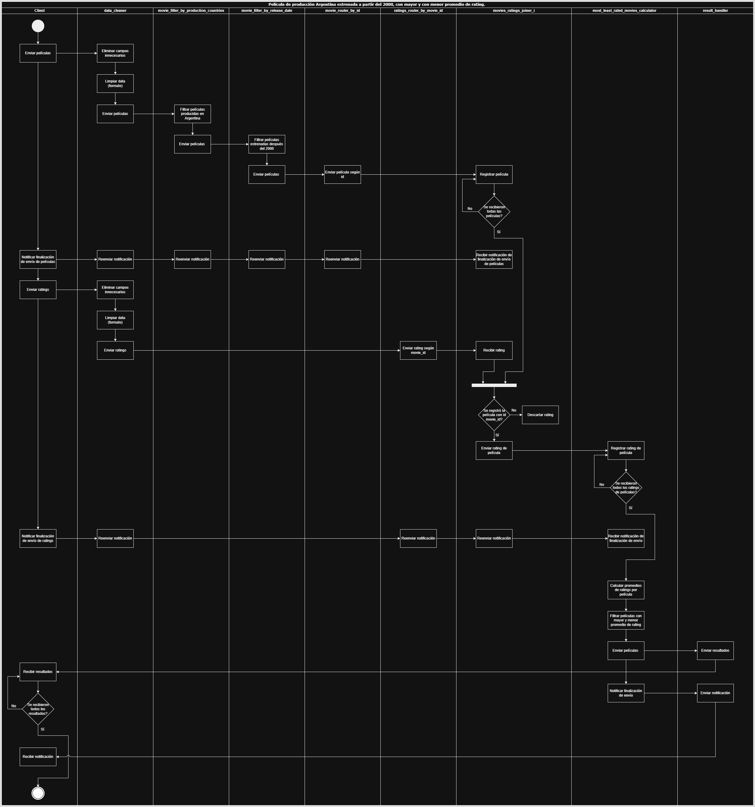
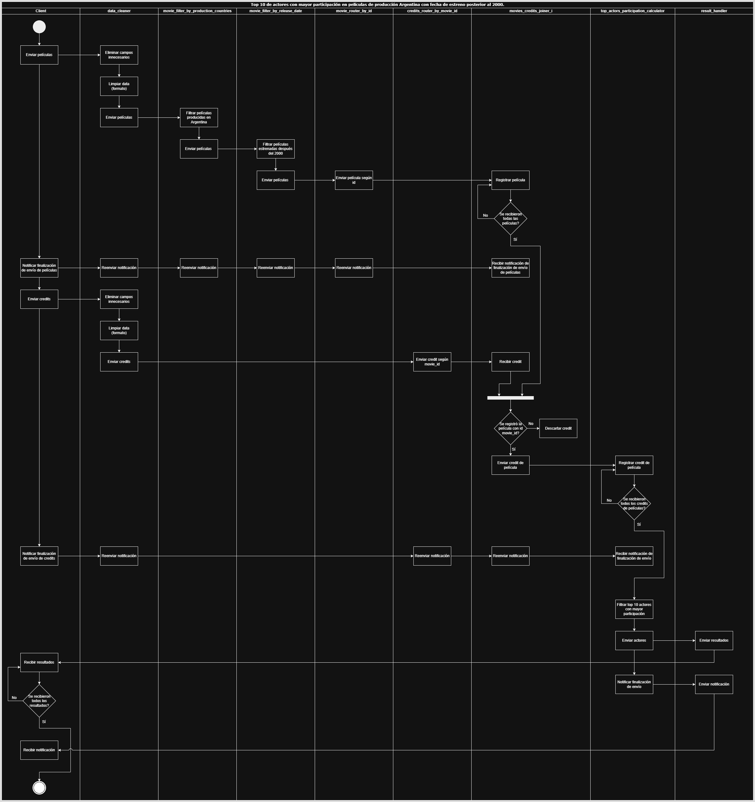
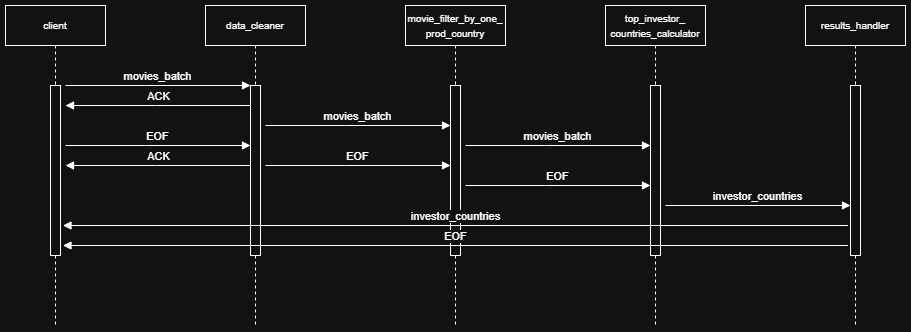
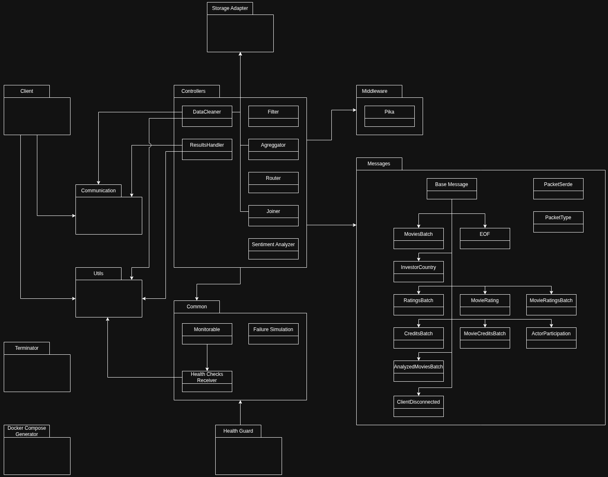

# Sistemas Distribuidos I

Este repositorio contiene el trabajo práctico realizado para la materia Sistemas Distribuidos I de la Facultad de Ingeniería de la Universidad de Buenos Aires.

## Integrantes

- [Alan Botoshansky](https://github.com/AlanBotoshansky) - Padrón: 108933
- [Ivan Botoshansky](https://github.com/IvanBotoshansky) - Padrón: 108897
- [Bruno Pascaretta](https://github.com/BrunoPasca) - Padrón: 107840

---

## Diseño

### Vista Física

#### Diagrama de Robustez


En el diagrama de robustez podemos observar un funcionamiento general del sistema. Se puede ver la manera en la que se ingresan los datos al sistema, y como colaboran y se comunican (mediante colas) los distintos controllers para resolver la consultas, hasta entregar los resultados de las distintas queries al cliente.

Los distintos controllers que podemos identificar en el diagrama se encargan de realizar distintas tareas:

- **Data Cleaner**: Elimina campos innecesarios y distribuye la información para la resolución de las queries.
- **Filters**: Filtran la información según distintos criterios.
- **Aggregators**: Realizan cálculos sobre los datos recibidos (como pueden ser sumas, promedios, entre otros).
- **Routers**: Redirigen la información hacia distintas colas según el valor de un campo determinado.
- **Joiners**: Juntan información de distintas fuentes según el valor de un campo determinado.
- **Sentiment Analyzer**: Es el encargado de realizar el análisis de sentimiento del overview de las películas para la query 5.
- **Results Handler**: Recibe los resultados y se los envía al cliente.

#### Diagrama de Despliegue


En el diagrama de despliegue podemos observar la topologia del sistema. El nodo central es el que aloja el servicio de RabbitMQ, y los demás nodos son los que alojan los distintos servicios para resolver las consultas. Cada uno de estos nodos se encarga de realizar una tarea específica, y se comunican entre sí mediante colas de RabbitMQ. El cliente se conecta al nodo central, y éste se encarga de redirigir la información a los distintos nodos para resolver las consultas.

### Vista de Procesos

#### Diagramas de Actividades

En esta sección se pueden observar los distintos diagramas de actividades para cada una de las queries. En cada uno de ellos se puede ver el flujo de trabajo y las distintas tareas que se realizan para resolver la consulta. Existe un diagrama de actividades para cada una de las queries ya que estas son independientes entre sí, por lo que se pueden realizar en paralelo, y cada una de ellas tiene un flujo de trabajo diferente.

##### Diagrama de Actividades de la Query 1


##### Diagrama de Actividades de la Query 2


##### Diagrama de Actividades de la Query 3



##### Diagrama de Actividades de la Query 4



##### Diagrama de Actividades de la Query 5


#### Diagramas de Secuencia

En esta sección se pueden observar los distintos diagramas de secuencia para cada una de las queries. En cada uno de ellos se puede ver de forma cronológica el intercambio de mensajes entre los distintos actores del sistema para resolver la consulta en cuestión.

##### Diagrama de Secuencia de la Query 1


##### Diagrama de Secuencia de la Query 2



##### Diagrama de Secuencia de la Query 3


##### Diagrama de Secuencia de la Query 4


##### Diagrama de Secuencia de la Query 5


### Vista de Desarrollo

#### Diagrama de Paquetes



En el diagrama de paquetes podemos observar la estructura del proyecto. Cada uno de los paquetes representa un módulo del sistema, y cada uno de ellos tiene una funcionalidad específica. Se pueden ver las dependencias entre los distintos paquetes, y en algunos de ellos se detallan los distintos componentes que incluyen. Por ejemplo, en el paquete `messages` se pueden ver los distintos mensajes que se utilizan para la comunicación entre los distintos nodos del sistema.

### DAG


El DAG (Direct Acyclic Graph) es una representación gráfica de las distintas tareas que se realizan para resolver las consultas. Cada nodo del DAG representa una tarea, y cada arista representa una dependencia entre las distintas tareas. El DAG permite visualizar de forma clara el flujo de trabajo del sistema, y cómo se distribuyen las tareas entre los distintos nodos. Además, en las aristas se especifican los distintos campos de la información que fluye entre los nodos. También se puede ver que a medida que fluye la información, hay campos que se van eliminando, ya que no son necesarios, y otros que se van agregando a medida que se van realizando las distintas tareas.

---

## Múltiples Clientes

Para que el sistema pueda soportar múltiples clientes, se realizaron las siguientes modificaciones:

### Campo `client_id` en todos los paquetes

Se agregó un campo `client_id` en todos los paquetes que se envían entre los distintos nodos del sistema. Este campo permite identificar a qué cliente pertenece cada paquete, y así poder enviarle la respuesta correspondiente. De esta manera, los clientes pueden realizar consultas simultáneamente, y el sistema puede responderle a cada uno de ellos de forma independiente. Gracias al `client_id`, los controllers que mantienen estado, como lo son los `Joiners` y `Aggregators`, pueden mantener el estado de cada cliente de forma independiente. Luego, el `Results Handler` envía los resultados correspondientes a cada cliente de acuerdo al `client_id` de cada resultado.

### Asignación de id único a cada cliente

Cada cliente, al conectarse al `Data Cleaner`, recibe un id único que lo identifica. Luego, envía este id al `Results Handler` para que éste luego pueda enviarle los resultados que le correspondan.

El siguiente diagrama ilustra la forma en la que se asigna el id único a cada cliente:


### Limpieza de estado de los clientes en los controllers

Se implementó un mecanismo de limpieza de estado en los controllers que mantienen estado, como lo son los `Joiners` y `Aggregators`.

Por un lado, luego de haber procesado la totalidad de los paquetes de un cliente, se eliminan los datos de estado de ese cliente. Por ejemplo, en los `Joiners`, luego de haber unido todos los paquetes de un cliente, se eliminan las péliculas que se tenían guardadas en memoria de ese cliente. De esta manera, se libera memoria y se evita que el sistema se sature con datos innecesarios.

Por el otro lado, si un cliente se desconecta de forma abrupta, se envia desde el `Data Cleaner` y se propaga a través de los distintos controllers un mensaje de tipo `ClientDisconnected`, que indica que el cliente se ha desconectado. Este mensaje es recibido por los `Joiners` y `Aggregators`, y se eliminan los datos de estado de ese cliente. De esta manera, se evita que el sistema mantenga datos innecesarios de clientes que ya no están conectados.

### Limite de cantidad de clientes que realizan consultas simultáneamente

Se implementó un mecanismo para limitar la cantidad de clientes que pueden realizar consultas simultáneamente. Dicha cantidad puede ser configurada en el archivo `config.ini` del `Data Cleaner` o pasado como variable de entorno llamada `MAX_CONCURRENT_CLIENTS`. Esto lo hicimos para evitar que el sistema reserve recursos de forma ilimitada, y así evitar ataques de denegación de servicio (DoS). Además, esto permite que el sistema atienda a los clientes de a "turnos", y así evitar que el sistema se sature, tanto en memoria como en CPU. Si se quieren atender a más clientes, se puede aumentar el límite de clientes simultáneos, y a su vez escalar el sistema horizontalmente, agregando más nodos al sistema.

## Tolerancia a Fallas

### 1. Sistema de Health Checks y Reinicio de Nodos

#### Health Checks

Para detectar nodos caídos, cada nodo del sistema implementa un servidor TCP en un proceso separado que escucha en el puerto 9911. Esta funcionalidad se logra mediante:

- **Clase Monitorable**: Clase base que extienden todos los controllers y servicios del sistema. Inicia un proceso daemon que ejecuta un `HealthChecksReceiver`.
- **HealthChecksReceiver**: Servidor TCP que acepta conexiones en el puerto 9911. Una conexión exitosa indica que el nodo está operativo, mientras que un timeout o error de conexión indica que el nodo está caído.

#### Servicio de Monitoreo (Health Guard)

El `HealthGuard` es un servicio distribuido con múltiples instancias que se encarga de:

1. **Realizar health checks periódicos**: Intenta conectarse al puerto 9911 de cada nodo monitoreado.
2. **Revivir nodos caídos**: Cuando detecta que un nodo no responde, utiliza la API de Docker para reiniciarlo automáticamente.
3. **Auto-supervisión**: Las instancias del Health Guard se supervisan entre sí, en forma de anillo, para detectar caídas y revivirse entre sí en caso de ser necesario.

La distribución de responsabilidades entre las instancias del Health Guard se realiza mediante un algoritmo de hash que asigna cada nodo a una instancia específica, evitando conflictos y garantizando cobertura completa.

### 2. Simulación de Fallas

Se implementaron dos mecanismos complementarios para simular fallas y validar la tolerancia a fallas del sistema:

#### 2.1 Terminator - Simulación Externa de Fallas

El `Terminator` es una herramienta externa que permite simular fallas de manera controlada mediante la terminación forzada de containers. Utiliza la API de Docker para identificar y matar containers específicos del proyecto.

**Modos de operación:**

- **Modo específico (`--mode specific`)**: Mata containers específicos por nombre. Útil para probar escenarios de falla particulares.

  ```bash
  python3 main.py --mode specific --arg "movies_filter_released_between_2000_and_2009_1,movies_filter_by_one_production_country_1"
  ```

- **Modo cantidad (`--mode count`)**: Mata un número determinado de containers seleccionados aleatoriamente. Simula fallas impredecibles en el sistema.

  ```bash
  python3 main.py --mode count --arg 3
  ```

- **Modo masivo (`--mode all`)**: Mata todos los containers posibles del sistema, con opción de excluir containers específicos.
  ```bash
  python3 main.py --mode all --arg "data_cleaner,results_handler"
  ```

**Protecciones implementadas:**

- **Containers protegidos**: RabbitMQ y clientes nunca son terminados para mantener la infraestructura básica.
- **Protección del Health Guard**: Siempre mantiene al menos una instancia activa para garantizar la recuperación automática.
- **Filtrado por proyecto**: Solo afecta containers del proyecto específico usando etiquetas de Docker Compose.

#### 2.2 Simulación Probabilística de Fallas

Además del terminator externo, se implementó un sistema de simulación de fallas internas basado en probabilidades que permite probar la robustez durante la ejecución normal.

**Configuración mediante Docker Compose Generator:**

El generador de docker compose permite configurar probabilidades de falla individuales para cada tipo de controller a través del archivo `config.ini`:

```ini
[FAILURE_PROBABILITIES]
MOVIES_FILTER_PRODUCED_IN_ARGENTINA_AND_SPAIN = 0.0
MOVIES_ROUTER_BY_ID = 0.1
TOP_INVESTOR_COUNTRIES_CALCULATOR = 0.05
# ... otros controllers
```

**Mecanismo de funcionamiento:**

1. **Función `fail_with_probability()`**: Cada controller puede invocar esta función en puntos críticos de su ejecución.
2. **Evaluación probabilística**: Se genera un número aleatorio que se compara con la probabilidad configurada.
3. **Falla simulada**: Si se cumple la condición, se lanza una `RuntimeError` que simula una falla inesperada.
4. **Puntos de falla estratégicos**: Los controllers invocan esta función antes y después de operaciones críticas como:
   - Procesamiento de mensajes
   - Envío de resultados
   - Limpieza de estado de clientes

**Ventajas de este enfoque:**

- **Fallas realistas**: Simula fallas que pueden ocurrir durante el procesamiento normal
- **Testing continuo**: Permite validar la recuperación durante toda la ejecución
- **Granularidad fina**: Cada controller puede tener una probabilidad diferente
- **Reproducibilidad**: Al usar semillas fijas, se pueden reproducir escenarios de falla específicos

Este sistema dual permite validar tanto la recuperación ante fallas catastróficas (terminator) como la resiliencia ante fallas intermitentes (probabilísticas).

### 3. Persistencia de Estado en Controllers Stateful

#### Controllers con Estado

Los siguientes controllers mantienen estado que debe persistir ante reinicios:

- **Joiners**: `MoviesJoiner` - Une información de películas, ratings y créditos.
- **Aggregators**:
  - `TopInvestorCountriesCalculator` - Calcula países con mayor inversión.
  - `MostLeastRatedMoviesCalculator` - Calcula películas mejor y peor calificadas.
  - `TopActorsParticipationCalculator` - Calcula actores con mayor participación.
  - `AvgRateRevenueBudgetCalculator` - Calcula promedios de rating, revenue y budget.

#### StorageAdapter: Dos Modos de Persistencia

El `StorageAdapter` implementa dos estrategias de persistencia diferentes según las necesidades específicas de cada controller:

#### 3.1 Modo Append (No Atómico) - Para MoviesJoiner

**Uso específico**: Únicamente utilizado por `MoviesJoiner` para almacenar películas conforme las recibe.

**Funcionamiento**:

- **Escritura incremental**: Cada película se almacena individualmente usando `append()` conforme llega.
- **Formato con longitud**: Cada entrada se prefija con su longitud en bytes para detectar corrupción:
  ```
  [3_bytes_longitud][clave,valor]
  ```
- **Tolerancia a corrupción**: Si una línea está corrupta (típicamente la última si hubo una falla durante escritura), se ignora silenciosamente.
- **Ventaja**: La corrupción de la última entrada no es crítica porque el mensaje correspondiente a dicha línea no fue ACKeado, por lo que se lo volverá a recibir tras el reinicio.

**Razón del diseño**: Las películas son datos que se pueden re-recibir sin problema, por lo que la pérdida de la última película almacenada no afecta la correctitud del sistema.

#### 3.2 Modo Atómico - Para Aggregators y Estado Crítico

**Uso específico**: Utilizado por todos los aggregators y para estado crítico del MoviesJoiner.

**Funcionamiento**:

- **Escritura atómica**: Se utiliza un archivo temporal y `os.replace()` para garantizar atomicidad:
  ```python
  # 1. Escribir a archivo temporal
  with open(temp_file, 'wb') as f:
      f.write(estado_serializado)
  # 2. Reemplazo atómico
  os.replace(temp_file, archivo_final)
  ```
- **Consistencia garantizada**: El archivo siempre contiene un estado válido completo o el estado anterior.
- **Sin corrupción parcial**: No puede quedar en estado intermedio corrupto.

**Razón del diseño**: Los aggregators mantienen estado crítico (sumas, conteos, etc) que no se puede re-calcular fácilmente, requiriendo persistencia confiable.

#### 3.3 Sistema de File Keys

El `StorageAdapter` utiliza un sistema de claves jerárquico:

**File Key Principal**: Identifica la información almacenada:

Ejemplos:

- `"movies"` - Películas almacenadas por MoviesJoiner
- `"state"` - Estado principal de aggregators
- `"all_movies_received"` - Clientes de los cuales se recibieron todas las películas (Joiners)

**File Key Secundaria**: Permite separación por cliente:

- Combinación: `file_key + secondary_file_key`
- Ejemplo: `"movies" + "client_123"` → archivo `movies_client_123`
- Permite almacenar el estado de cada cliente en un archivo separado

**Ventajas del sistema**:

- **Aislamiento por cliente**: Cada cliente tiene archivos independientes
- **Limpieza granular**: Se puede eliminar el estado de un cliente específico de forma sencilla, eliminando su archivo correspondiente.
- **Escalabilidad**: Evita archivos únicos masivos con todos los clientes. Al actualizar el estado de un cliente, solo se modifica su archivo específico.

Esta arquitectura dual permite optimizar la persistencia según los requisitos de cada controller, balanceando performance y confiabilidad.

### 4. Prevención de Duplicados en Aggregators

#### Sistema de IDs de Mensajes

Para evitar el procesamiento duplicado de mensajes tras reinicios:

1. **Asignación de message_id**: Cada mensaje contiene un campo `message_id` que lo identifica de forma unívoca.
2. **Registro de procesamiento**: Cada aggregator mantiene un conjunto de `message_id` ya procesados.
3. **Verificación antes de procesar**: Solo se procesan mensajes cuyo `message_id` no haya sido registrado previamente.
4. **Persistencia de IDs**: Los `message_id` procesados se almacenan en disco para mantener la información tras reinicios.

### 5. Gestión de Caída del Data Cleaner

#### Impacto Crítico

La caída del `DataCleaner` es crítica porque:

- Corta la conexión con todos los clientes activos
- Se pierden los mensajes encolados en la cola interna

#### Estrategia de Recuperación

1. **Persistencia de clientes conectados**:

   - Al conectarse: Se registra el ID del cliente en archivo.
   - Al desconectarse: Se elimina el ID del archivo.
   - Se utiliza un lock para manejar acceso concurrente al archivo.

2. **Notificación de desconexión**: Al reiniciar, el `DataCleaner` lee la lista de clientes que estaban conectados previamente y envía mensajes `ClientDisconnected` para limpiar su estado en todos los controllers.

3. **Lógica de reconexión del cliente**:
   - Detecta la desconexión del servidor
   - Finaliza el proceso receptor de resultados
   - Espera un intervalo configurable
   - Reintenta la conexión (con límite de reintentos)
   - Si se reconecta exitosamente, recibe un nuevo ID y reinicia el flujo completo

### 6. Gestión de Caída del Results Handler

#### Impacto Crítico

Similar al `DataCleaner`, la caída del `ResultsHandler` afecta:

- La conexión de clientes para recibir resultados
- Los mensajes de resultados encolados

#### Estrategia de Recuperación

1. **Detección de desconexión**: Los clientes detectan cuando se pierde la conexión con el `ResultsHandler`.
2. **Desconexión en cascada**: El cliente se desconecta también del `DataCleaner` para evitar enviar datos sin poder recibir resultados.
3. **Reconexión completa**: El cliente reinicia todo el proceso:
   - Reestablece la conexión para enviar datos
   - Recibe un nuevo ID de cliente
   - Reestablece la conexión para recibir resultados
   - Reinicia el envío de datos desde el principio

### 7. Limpieza de Estado por Desconexión de Clientes

#### Propagación de Desconexión

Cuando un cliente se desconecta (ya sea normalmente o por falla), se propaga un mensaje `ClientDisconnected` a través de todo el pipeline que:

1. **Limpia memoria**: Elimina todos los datos en memoria asociados al cliente desconectado.
2. **Limpia persistencia**: Elimina los archivos de estado del cliente del disco.
3. **Previene memory leaks**: Evita que el sistema acumule datos de clientes que ya no están activos.

Esta implementación de tolerancia a fallas garantiza que el sistema pueda recuperarse automáticamente de fallos de nodos individuales, mantener la consistencia de datos a través de reinicios, y gestionar adecuadamente las desconexiones y reconexiones de clientes.
