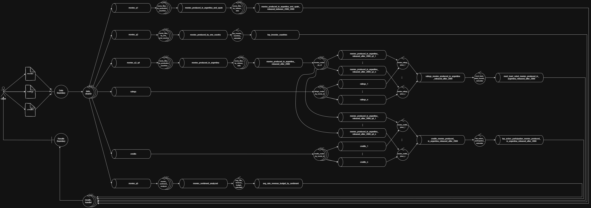
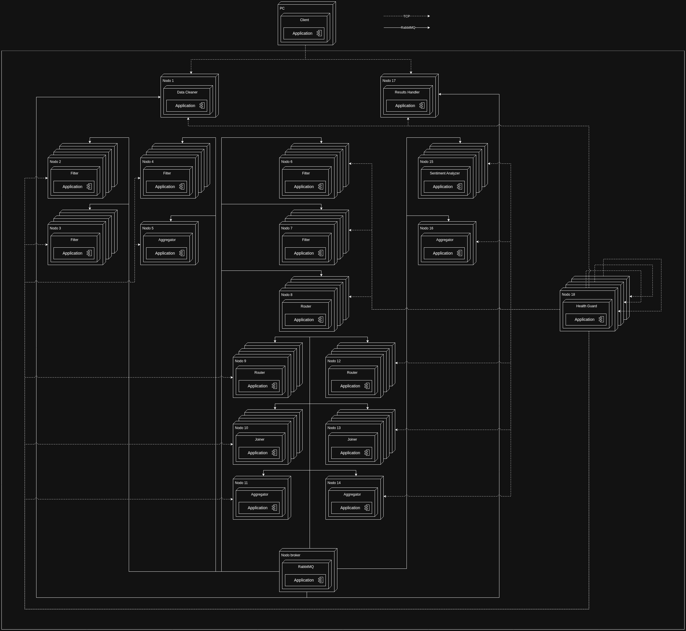
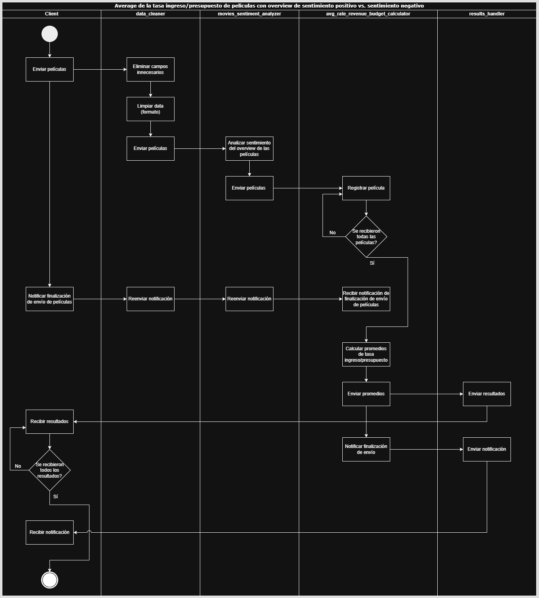
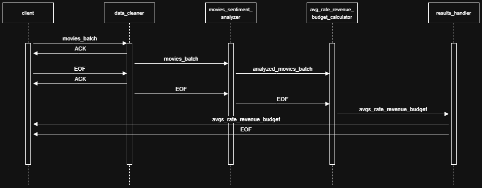
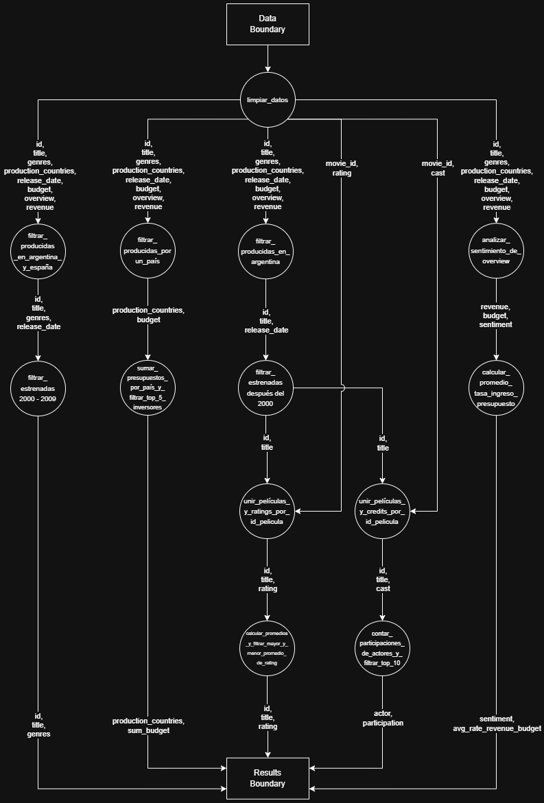

# Sistemas Distribuidos I

Este repositorio contiene el trabajo práctico realizado para la materia Sistemas Distribuidos I de la Facultad de Ingeniería de la Universidad de Buenos Aires.

## Integrantes

- [Alan Botoshansky](https://github.com/AlanBotoshansky) - Padrón: 108933
- [Ivan Botoshansky](https://github.com/IvanBotoshansky) - Padrón: 108897
- [Bruno Pascaretta](https://github.com/BrunoPasca) - Padrón: 107840

---

## Diseño

### Vista Física

#### Diagrama de Robustez

En el diagrama de robustez podemos observar un funcionamiento general del sistema. Se puede ver la manera en la que se ingresan los datos al sistema, y como colaboran y se comunican (mediante colas) los distintos controllers para resolver la consultas, hasta entregar los resultados de las distintas queries al cliente.

Los distintos controllers que podemos identificar en el diagrama se encargan de realizar distintas tareas:

- **Data Cleaner**: Elimina campos innecesarios y distribuye la información para la resolución de las queries.
- **Filters**: Filtran la información según distintos criterios.
- **Aggregators**: Realizan cálculos sobre los datos recibidos (como pueden ser sumas, promedios, entre otros).
- **Routers**: Redirigen la información hacia distintas colas según el valor de un campo determinado.
- **Joiners**: Juntan información de distintas fuentes según el valor de un campo determinado.
- **Sentiment Analyzer**: Es el encargado de realizar el análisis de sentimiento del overview de las películas para la query 5.
- **Results Handler**: Recibe los resultados y se los envía al cliente.

#### Diagrama de Despliegue

En el diagrama de despliegue podemos observar la topologia del sistema. El nodo central es el que aloja el servicio de RabbitMQ, y los demás nodos son los que alojan los distintos servicios para resolver las consultas. Cada uno de estos nodos se encarga de realizar una tarea específica, y se comunican entre sí mediante colas de RabbitMQ. El cliente se conecta al nodo central, y éste se encarga de redirigir la información a los distintos nodos para resolver las consultas.

### Vista de Procesos

#### Diagramas de Actividades

En esta sección se pueden observar los distintos diagramas de actividades para cada una de las queries. En cada uno de ellos se puede ver el flujo de trabajo y las distintas tareas que se realizan para resolver la consulta. Existe un diagrama de actividades para cada una de las queries ya que estas son independientes entre sí, por lo que se pueden realizar en paralelo, y cada una de ellas tiene un flujo de trabajo diferente.

##### Diagrama de Actividades de la Query 1

##### Diagrama de Actividades de la Query 2

##### Diagrama de Actividades de la Query 3

##### Diagrama de Actividades de la Query 4

##### Diagrama de Actividades de la Query 5

#### Diagramas de Secuencia

En esta sección se pueden observar los distintos diagramas de secuencia para cada una de las queries. En cada uno de ellos se puede ver de forma cronológica el intercambio de mensajes entre los distintos actores del sistema para resolver la consulta en cuestión.

##### Diagrama de Secuencia de la Query 1

##### Diagrama de Secuencia de la Query 2

##### Diagrama de Secuencia de la Query 3

##### Diagrama de Secuencia de la Query 4

##### Diagrama de Secuencia de la Query 5

### Vista de Desarrollo

#### Diagrama de Paquetes

En el diagrama de paquetes podemos observar la estructura del proyecto. Cada uno de los paquetes representa un módulo del sistema, y cada uno de ellos tiene una funcionalidad específica. Se pueden ver las dependencias entre los distintos paquetes, y en algunos de ellos se detallan los distintos componentes que incluyen. Por ejemplo, en el paquete `messages` se pueden ver los distintos mensajes que se utilizan para la comunicación entre los distintos nodos del sistema.

### DAG

El DAG (Direct Acyclic Graph) es una representación gráfica de las distintas tareas que se realizan para resolver las consultas. Cada nodo del DAG representa una tarea, y cada arista representa una dependencia entre las distintas tareas. El DAG permite visualizar de forma clara el flujo de trabajo del sistema, y cómo se distribuyen las tareas entre los distintos nodos. Además, en las aristas se especifican los distintos campos de la información que fluye entre los nodos. También se puede ver que a medida que fluye la información, hay campos que se van eliminando, ya que no son necesarios, y otros que se van agregando a medida que se van realizando las distintas tareas.
